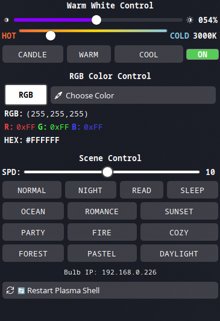

# WiZ Bulb Control Plasmoid  

A KDE Plasma 6 widget for controlling WiZ smart bulbs with full RGB color control, brightness adjustment, warm white temperature settings, and scene selection. 




## Compatibility

The widget has been tested on Kubuntu 25.04 on Wayland (should also work on X11) with a WiZ A60 RGB bulb, but it should work with most WiZ bulbs, or atleast the ones that [pywizlight](https://github.com/sbidy/pywizlight) supports.


## Installation

1. Clone or download this repository

2. Install the widget:

   **Option A: Automatic (Recommended)**
   ```bash
   chmod +x install.sh
   ./install.sh
   ```

   **Option B: Manual**
   ```bash
   mkdir -p ~/.local/share/plasma/plasmoids/
   cp -r plasmoid ~/.local/share/plasma/plasmoids/org.kde.plasma.wizcontrol
   ```

3. Restart Plasma Shell (or just relogin) : 
   ```bash
   kquitapp6 plasmashell && kstart plasmashell
   ```

4. Add the widget to your panel or desktop:
   - Right-click on panel/desktop → "Add Widgets..."
   - Search for "WiZ Smart Bulb Control"
   - Add to panel or desktop


## Acknowledgments

- [pywizlight](https://github.com/sbidy/pywizlight) - The Python library for WiZ bulb communication
- The application was based on org.kde.plasma.brightness

